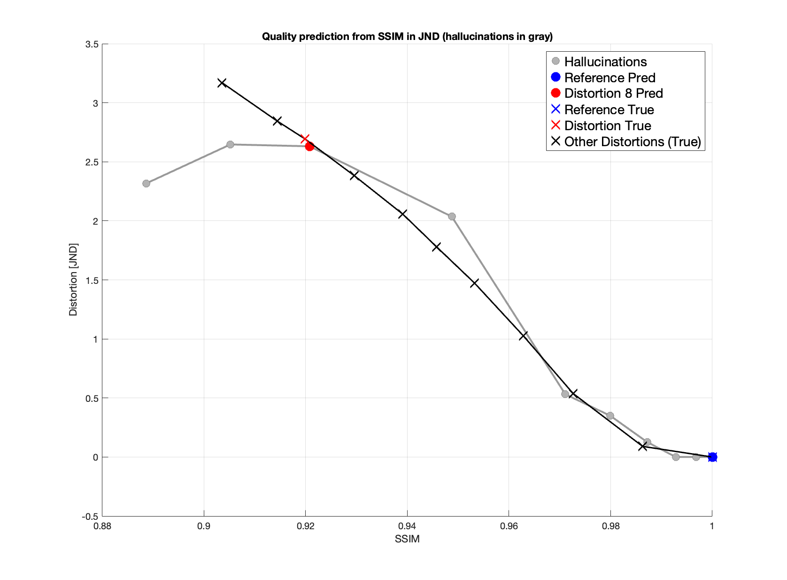

# pairwise-iqa-framework
_Last updated: 01.09.2025_
### Credit
The full dataset of 26 features was created by Shima Mohammadi. The full dataset in not included, however the reduced one is which was only modified slightly. The bitrate for the reference images wasn't calculated, therefore arbitrary values were set.

# General
`main.m` runs the tests/models.
`main_visualizations.m` runs the visualizations.
Exception: running `experiment_6_H` in the main will produce a plot right away.  
# Hallucination Model
Here the results for the hallucination concept are shown. Explanation of the idea is in the Thesis.

This plot shows the predicted quality in JNDfor a series of images:

- **Gray circles**: Hallucinated images generated between/beyond the reference and the distorted image.
- **Blue circle/X**: The reference image (ground truth and prediction).
- **Red circle/X**: The distorted image (ground truth and prediction).
- **Black X's**: Other ground truth measurements.
- The **gray line** connects the hallucinated images, visualizing the hallucination "path" in the quality space.

SSIM values for ground truth and predictions may be slightly different, likely due to small discrepancies in calculation methods or library versions.

The method works well because the predicted and true values are close for most of the images. There is a noticeable fall-off at the end of the path, but this could be due to the fact that we are only using a single metric (SSIM) for the prediction. Due to limited time, we focused on demonstrating that the approach works for at least one metric.
